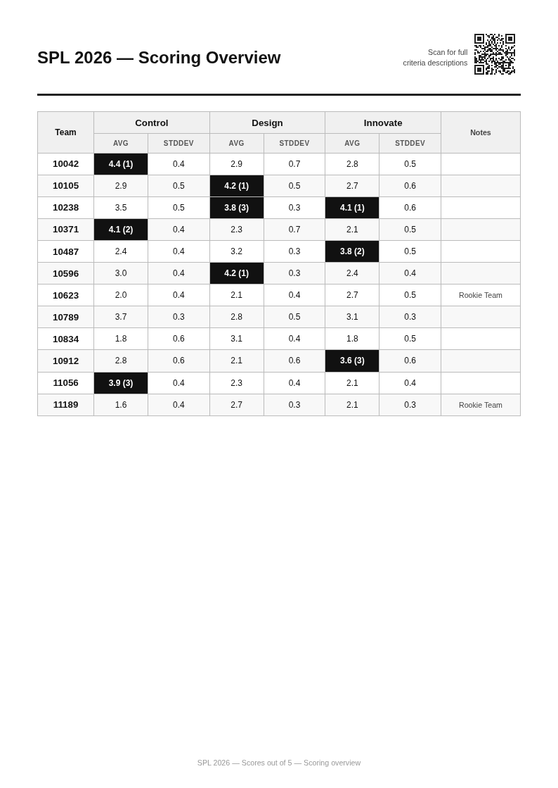
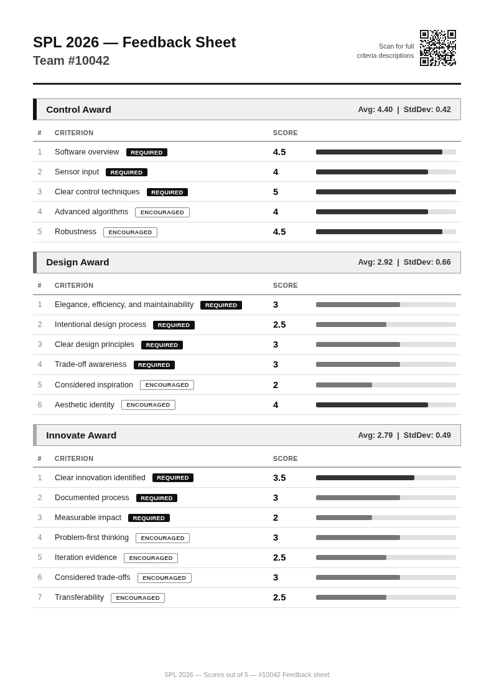
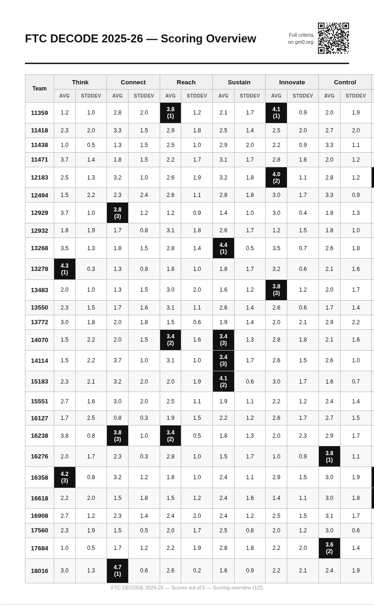
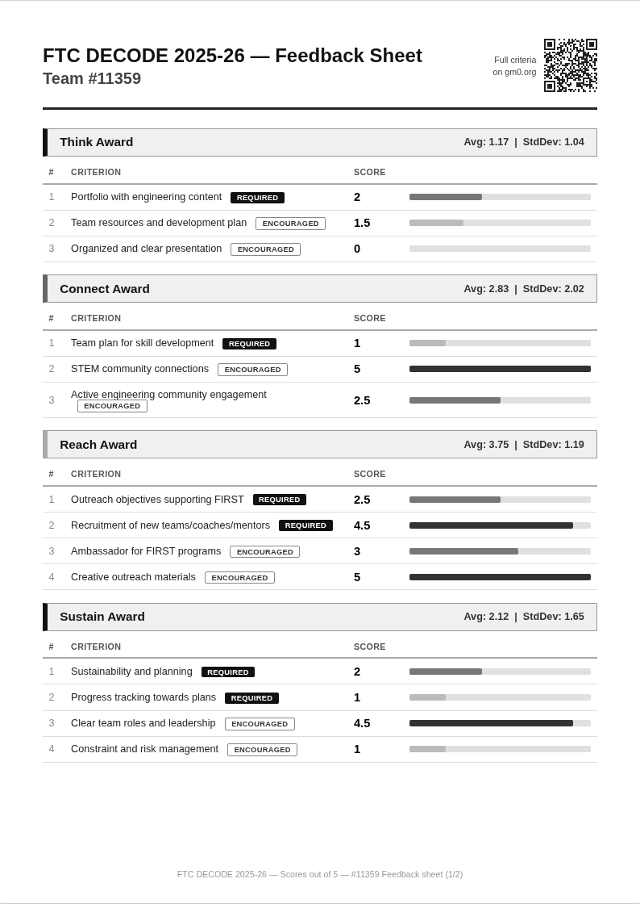
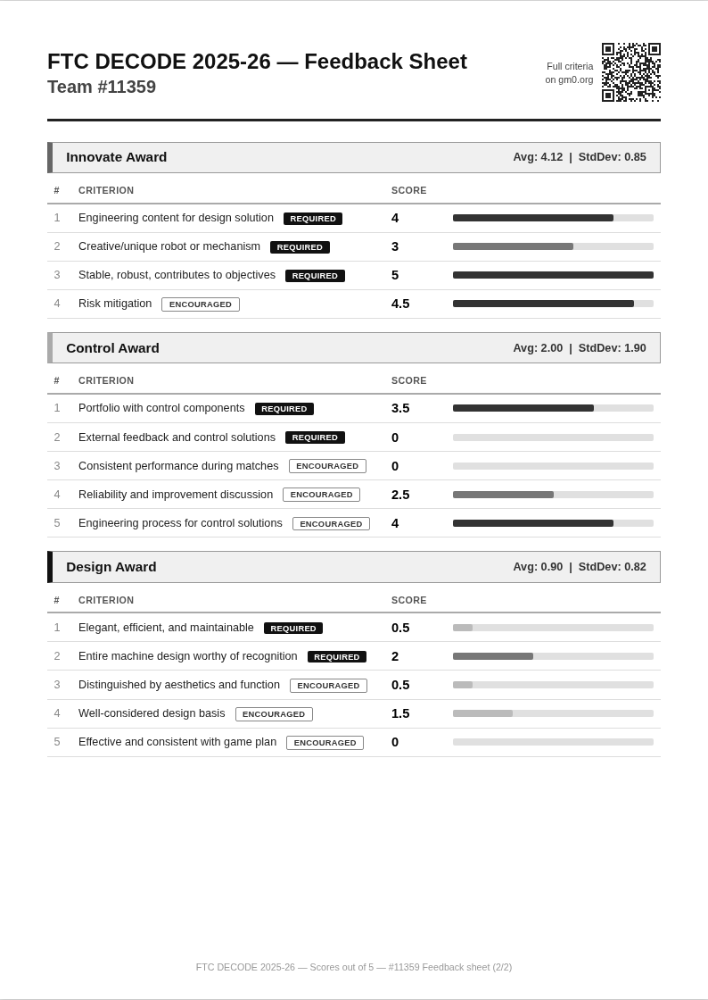

# OpenAward

A configurable, print-ready feedback sheet generator for robotics competition scoring. Built for [FIRST Tech Challenge](https://www.firstinspires.org/robotics/ftc) and [SPL](https://wiki.teamclockworks.ro/en/spl-rules), but adaptable to any competition with award-based judging criteria.

OpenAward reads a JSON config defining awards and criteria, pairs it with a flat CSV of scores, and produces a single HTML file containing:

- **Scoring overview pages** with per-award averages, standard deviations, and top-3 highlights
- **Per-team feedback sheets** with individual criterion scores, bar charts, and notes
- **Automatic pagination** that keeps award sections intact across multiple pages
- **QR codes** linking to full criteria descriptions

Everything is optimized for **grayscale A4 printing** with `print-color-adjust: exact`.

## Examples

### SPL 2026 (3 awards, 18 criteria)

**Scoring overview** — top-3 placements highlighted per award:



**Team feedback sheet** — all awards fit on one page:



### FIRST FTC DECODE 2025-26 (7 awards, 28 criteria)

**Scoring overview** — 30 teams, paginated at 26 per page:



**Team feedback sheet** — auto-paginated across two pages:




## Quick start

```bash
pip install segno
python generate_feedback.py config.json scoring_sheet.csv
# Open feedback_sheets.html in a browser and print to PDF or paper
```

## Configuration

### Config file (JSON)

```json
{
  "title": "SPL 2026",
  "max_score": 5,
  "qr_url": "https://wiki.teamclockworks.ro/en/spl-rules",
  "qr_label": "Scan for full\ncriteria descriptions",
  "awards": {
    "Control": [
      { "name": "Software overview", "required": true },
      { "name": "Sensor input", "required": true },
      { "name": "Advanced algorithms", "required": false }
    ],
    "Design": [
      { "name": "Elegance and efficiency", "required": true },
      { "name": "Aesthetic identity", "required": false }
    ]
  }
}
```

| Field | Description |
|-------|-------------|
| `title` | Competition name, shown in headers and footers |
| `max_score` | Maximum score per criterion (used for bar chart scaling) |
| `qr_url` | URL encoded in the QR code |
| `qr_label` | Label text next to the QR code (`\n` for line breaks) |
| `awards` | Ordered dict of award names to arrays of criteria |
| `awards.*.name` | Criterion display name |
| `awards.*.required` | `true` for required criteria (black badge), `false` for encouraged (outline badge) |

### Scoring CSV

The CSV must have columns `Team`, `C1` through `CN` (one per criterion across all awards, in order), and optionally `Notes`:

```csv
Team,C1,C2,C3,C4,C5,Notes
15989,4,2.5,4.5,3,4.5,
21087,5,4.5,5,5,4,Strong overall
```

Criteria columns map left-to-right through the awards in config order. For a config with Control (5 criteria) and Design (6 criteria), columns C1-C5 are Control and C6-C11 are Design.

## Features

### Top-3 podium highlights

The three highest-scoring teams per award are highlighted in the scoring overview with inverted cells (black background, white text) and placement numbers. Ties share the same placement.

### Automatic pagination

Team feedback sheets are automatically paginated based on estimated content height. Award sections are never split across pages — if an award doesn't fit on the current page, it moves to the next one. Each page carries its own header, footer, and page indicator (e.g., "Feedback sheet (1/2)").

### Print-optimized design

- Grayscale-only palette for reliable photocopying
- A4 page dimensions with proper margins
- `print-color-adjust: exact` ensures bar charts, badges, and podium highlights print correctly
- `page-break-after: always` for clean page separation

## Generating screenshots

For documentation or previews, use `docs/take_screenshots.py` with [Playwright](https://playwright.dev/python/):

```bash
pip install playwright
playwright install chromium
python docs/take_screenshots.py
```

This renders the HTML in headless Chromium and saves specific pages as PNGs in `docs/`.

## License

MIT
